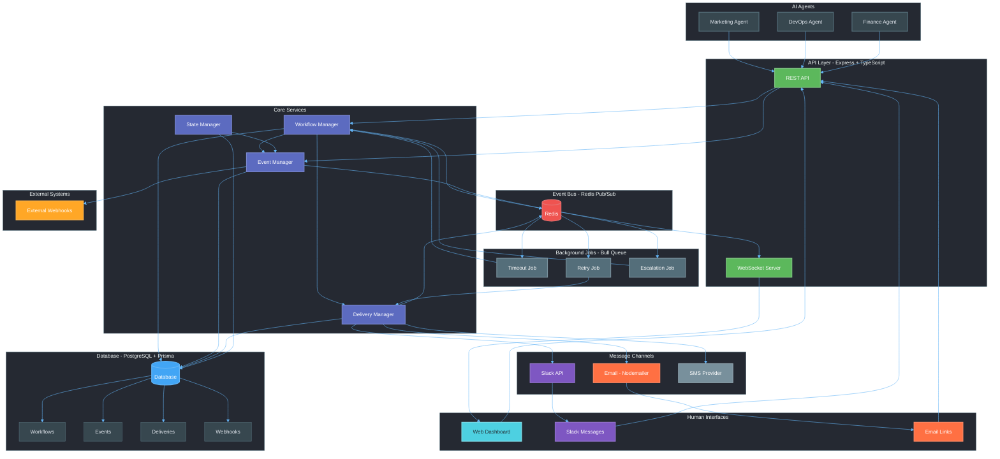
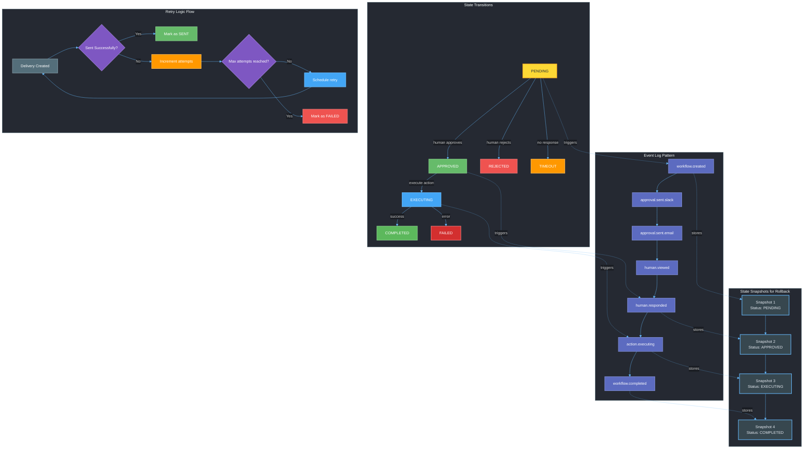
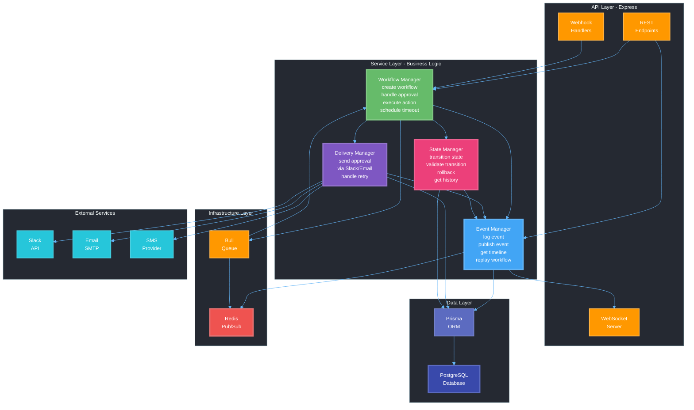
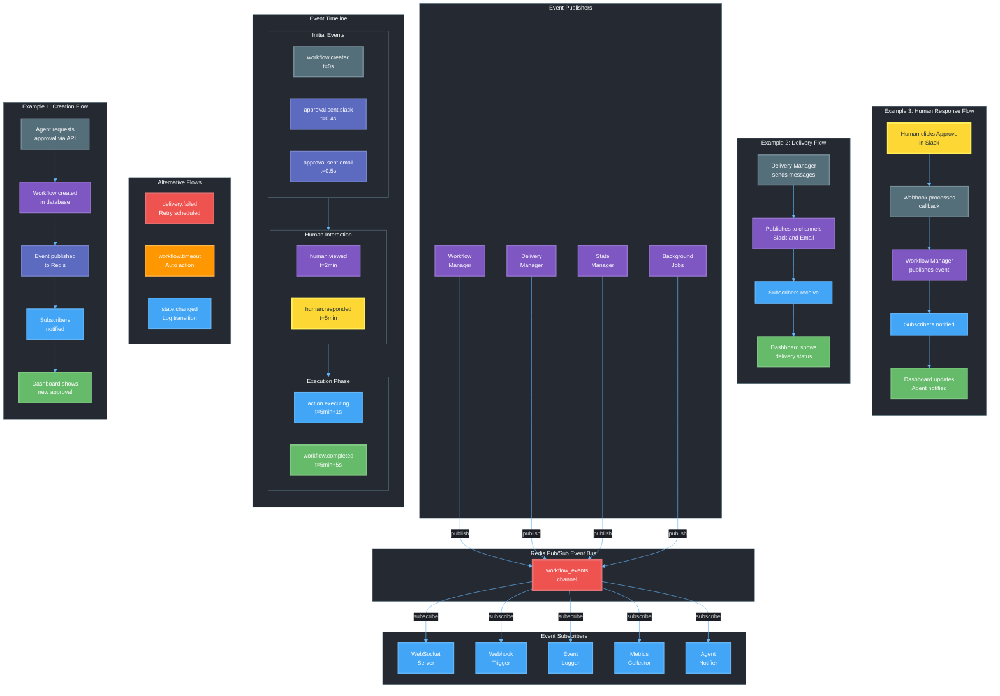

# Express.js Backend with PostgreSQL Database & Prisma ORM

## 📐 Architecture Overview

The following diagram illustrates the system architecture and component interactions:



---

## 🔄 Approval Request Flow

This sequence diagram shows how a single approval request moves through the system:

```mermaid
%%{init: {'theme':'dark', 'themeVariables': { 
  'background':'#000000',
  'mainBkg':'#000000',
  'secondBkg':'#1a1d23',
  'tertiaryBkg':'#252932',
  'primaryColor':'#42a5f5',
  'primaryTextColor':'#ffffff',
  'primaryBorderColor':'#90caf9',
  'lineColor':'#90caf9',
  'secondaryColor':'#5c6bc0',
  'tertiaryColor':'#7986cb',
  'actorBkg':'#37474f',
  'actorBorder':'#90caf9',
  'actorTextColor':'#ffffff',
  'actorLineColor':'#90caf9',
  'signalColor':'#90caf9',
  'signalTextColor':'#ffffff',
  'labelBoxBkgColor':'#252932',
  'labelBoxBorderColor':'#90caf9',
  'labelTextColor':'#ffffff',
  'loopTextColor':'#ffffff',
  'noteBorderColor':'#546e7a',
  'noteBkgColor':'#1a1d23',
  'noteTextColor':'#e3e8ef',
  'activationBorderColor':'#90caf9',
  'activationBkgColor':'#5c6bc0',
  'sequenceNumberColor':'#ffffff',
  'sectionBkgColor':'#1a1d23',
  'altSectionBkgColor':'#252932',
  'sectionBkgColor2':'#2c3e50',
  'taskBorderColor':'#90caf9',
  'taskBkgColor':'#3949ab',
  'taskTextColor':'#ffffff',
  'activeTaskBorderColor':'#90caf9',
  'activeTaskBkgColor':'#5c6bc0',
  'gridColor':'#37474f',
  'doneTaskBkgColor':'#66bb6a',
  'doneTaskBorderColor':'#81c784',
  'critBkgColor':'#ef5350',
  'critBorderColor':'#e57373',
  'todayLineColor':'#42a5f5',
  'fontSize':'16px',
  'fontFamily':'Arial, sans-serif'
}}}%%
sequenceDiagram
    participant Agent as AI Agent
    participant API as API Server
    participant WM as Workflow Manager
    participant EM as Event Manager
    participant DM as Delivery Manager
    participant DB as PostgreSQL
    participant Redis as Redis Pub/Sub
    participant BG as Background Jobs
    participant Slack as Slack API
    participant Email as Email Service
    participant Human as Human Approver
    participant WS as WebSocket
    
    rect rgb(26, 29, 35)
    Note over Agent,API: Step 1: Agent Requests Approval
    Agent->>+API: POST /workflows/create
    Note right of Agent: actionType, actionData, uiSchema
    
    API->>+WM: createWorkflow()
    WM->>+DB: Insert Workflow (PENDING)
    DB-->>-WM: workflow created
    
    WM->>+EM: emit workflow.created
    EM->>DB: Insert Event + snapshot
    EM->>Redis: publish workflow.created
    EM-->>-WM: acknowledged
    end
    
    rect rgb(37, 47, 55)
    Note over WM,Email: Step 2: Multi-Channel Delivery
    WM->>+DM: sendApproval(workflow)
    
    par Slack Channel
        DM->>DB: Insert Delivery (slack)
        DM->>+Slack: Send interactive message
        Slack-->>-DM: message_id
        DM->>DB: Update Delivery (sent)
        DM->>EM: emit approval.sent.slack
    and Email Channel
        DM->>DB: Insert Delivery (email)
        DM->>+Email: Send approval email
        Email-->>-DM: email_id
        DM->>DB: Update Delivery (sent)
        DM->>EM: emit approval.sent.email
    end
    
    DM-->>-WM: delivery complete
    EM->>Redis: publish events
    Redis->>+WS: broadcast to dashboard
    WS->>Human: Real-time update
    WS-->>-Redis: acknowledged
    end
    
    rect rgb(26, 29, 35)
    Note over WM,BG: Step 3: Schedule Timeout
    WM->>Redis: schedule timeout job
    Redis->>+BG: enqueue(workflowId, expiresAt)
    BG-->>-Redis: job scheduled
    WM-->>-API: workflow created
    API-->>-Agent: workflowId, status: PENDING
    end
    
    rect rgb(50, 80, 70)
    Note over Human,API: Step 4: Human Responds (Success Path)
    Human->>Slack: Click "Approve"
    Slack->>+API: POST /webhooks/slack/callback
    Note right of Slack: workflowId, decision: approved
    
    API->>+WM: handleApproval(workflowId, decision)
    WM->>DB: Update Workflow (APPROVED)
    
    WM->>+EM: emit human.responded
    EM->>DB: Insert Event + snapshot
    EM->>Redis: publish human.responded
    EM-->>-WM: acknowledged
    end
    
    rect rgb(37, 47, 55)
    Note over WM,Redis: Step 5: Cancel Timeout & Execute
    WM->>Redis: cancel timeout job
    Redis-->>WM: job cancelled
    
    WM->>WM: executeAction()
    WM->>DB: Update Workflow (EXECUTING)
    WM->>EM: emit action.executing
    
    Note over WM: Perform actual action<br/>(send email, deploy, etc)
    
    WM->>DB: Update Workflow (COMPLETED)
    WM->>+EM: emit workflow.completed
    EM->>DB: Insert Event + snapshot
    EM->>Redis: publish workflow.completed
    EM-->>-WM: acknowledged
    WM-->>-API: execution complete
    API-->>-Slack: acknowledged
    end
    
    rect rgb(26, 29, 35)
    Note over Redis,Human: Step 6: Notify Completion
    Redis->>Agent: workflow completed
    Redis->>+WS: broadcast update
    WS->>Human: Show completion status
    WS-->>-Redis: acknowledged
    end
    
    rect rgb(60, 40, 30)
    Note over BG,Human: Alternative: Timeout Scenario
    BG->>DB: Check expired workflows
    BG->>+WM: handleTimeout(workflowId)
    WM->>DB: Update Workflow (TIMEOUT)
    WM->>+EM: emit workflow.timeout
    EM->>Redis: publish workflow.timeout
    EM-->>-WM: acknowledged
    WM-->>-BG: timeout handled
    end
    
    %% Color coding participant boxes to match architecture diagram
    %%{init: {'themeVariables': {
      'actor1Bkg':'#37474f',
      'actor2Bkg':'#5cb85c',
      'actor3Bkg':'#5c6bc0',
      'actor4Bkg':'#5c6bc0',
      'actor5Bkg':'#5c6bc0',
      'actor6Bkg':'#42a5f5',
      'actor7Bkg':'#ef5350',
      'actor8Bkg':'#546e7a',
      'actor9Bkg':'#7e57c2',
      'actor10Bkg':'#ff7043',
      'actor11Bkg':'#37474f',
      'actor12Bkg':'#5cb85c'
    }}}%%
```



---

## 🔀 State Management & Event Flow

This diagram shows how state transitions, event logs, snapshots, and retry logic work together:



---

## 🗄️ Database Schema Visualization

This entity-relationship diagram shows the database structure and relationships:

```mermaid
%%{init: {'themeVariables': {'scale': 0.5}}}%%
erDiagram
    WORKFLOW ||--o{ WORKFLOW_EVENT : "has many"
    WORKFLOW ||--o{ DELIVERY : "has many"
    WEBHOOK ||..o{ WORKFLOW_EVENT : "notified by"
    
    WORKFLOW {
        string id PK
        string name
        string agentId
        string status "PENDING|APPROVED|REJECTED|etc"
        string actionType
        json actionData
        string approverEmail
        datetime expiresAt
        string timeoutAction "reject|approve|escalate"
        json uiSchema "Dynamic form config"
        string decision "approved|rejected|modified"
        json responseData "Modified values"
        string feedback
        datetime respondedAt
        datetime createdAt
        datetime updatedAt
    }
    
    WORKFLOW_EVENT {
        string id PK
        string workflowId FK
        string type "workflow.created|approved|etc"
        json data "Event payload"
        json stateSnapshot "Complete state for rollback"
        string actor "Who triggered"
        string source "api|slack_webhook|timeout_job"
        datetime timestamp
    }
    
    DELIVERY {
        string id PK
        string workflowId FK
        string channel "slack|email|sms"
        string recipient "email|slack_id|phone"
        string status "pending|sent|delivered|failed"
        int attempts
        int maxAttempts
        datetime nextRetryAt "For retry job"
        string lastError
        json metadata "Channel-specific data"
        datetime sentAt
        datetime deliveredAt
        datetime createdAt
    }
    
    WEBHOOK {
        string id PK
        string url
        string_array events "Event types to listen"
        string secret "For HMAC signature"
        boolean isActive
        datetime createdAt
    }
```



---

## 🏗️ Service Layer Architecture

This diagram illustrates the service layer organization and dependencies:



---

## 🔔 Event-Driven Architecture Flow

This comprehensive diagram shows the event-driven architecture with publishers, subscribers, and event timelines:



---

## 🚀 Getting Started

Follow these steps to set up and run the backend locally.

### 1️⃣ Clone the Repository

```sh
git clone "https://github.com/lyzr-projects/human-in-loop-backend.git"
cd human-in-loop-backend
```

### 2️⃣ Checkout to the Main Branch

```sh
git checkout main
```

### 3️⃣ Install Dependencies

```sh
yarn
```

### 4️⃣ Set Up Environment Variables

- Create a `.env` file in the root directory.
- Obtain the required environment variables from the admin and update the `.env` file accordingly.

### 5️⃣ Generate Prisma Client

```sh
npx prisma generate
```

### 6️⃣ Run Database Migrations

Apply database migrations to create/update tables in PostgreSQL:

```sh
npx prisma migrate dev --name init
```

This command will:

- Create a new migration file in `prisma/migrations/`
- Apply the migration to your PostgreSQL database
- Automatically regenerate the Prisma Client

**Alternative (Quick Sync for Development):**

If you want to quickly sync your schema without creating migration files:

```sh
npx prisma db push
```

### 7️⃣ Build the Project

```sh
yarn build
```

### 8️⃣ Start the Backend Server

```sh
yarn dev
```

The backend should now be running! 🚀

---

## 🗃️ Database & Prisma Management

### Prisma Migrations

Prisma migrations help you manage database schema changes in a controlled and versioned way.

#### Create a New Migration

After making changes to `prisma/schema.prisma`, create a new migration:

```sh
npx prisma migrate dev --name <migration_name>
```

#### Apply Migrations in Production

Deploy pending migrations to production:

```sh
npx prisma migrate deploy
```

#### Check Migration Status

View the status of all migrations:

```sh
npx prisma migrate status
```

#### Reset Database (⚠️ Deletes All Data)

Reset the database and reapply all migrations:

```sh
npx prisma migrate reset
```

**Warning:** This will delete all data in your database!

#### Prisma Studio (Database GUI)

Open a browser-based GUI to view and edit your database:

```sh
npx prisma studio
```

This runs on `http://localhost:
