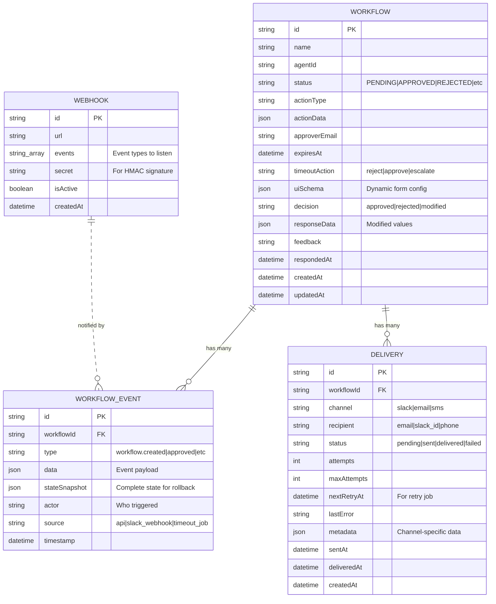
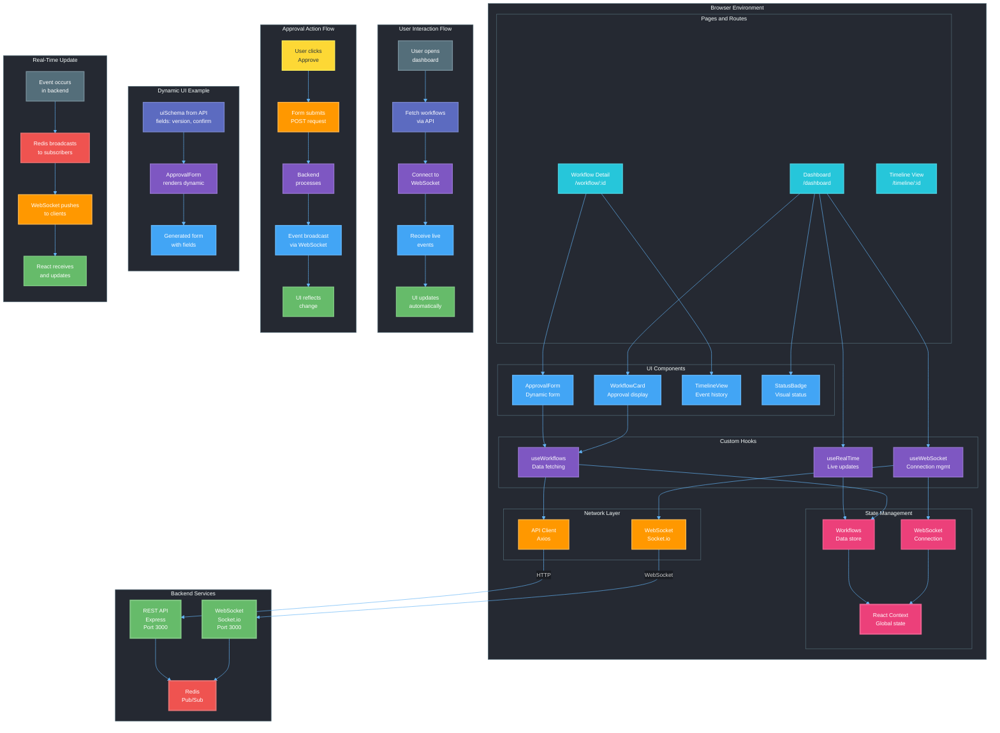

# Express.js Backend with PostgreSQL Database & Prisma ORM

## 📐 Architecture Overview

The following diagram illustrates the system architecture and component interactions:


---

## 🔄 Approval Request Flow

This sequence diagram shows how a single approval request moves through the system:


---

## 📨 Multichannel Delivery Flow

This diagram illustrates how approval requests are delivered through multiple channels (Slack, Email, SMS) in parallel, with retry logic and failure handling:

```mermaid
%%{init: {'theme':'dark', 'themeVariables': { 'darkMode':'true', 'background':'#1a1d23', 'primaryColor':'#42a5f5', 'primaryTextColor':'#e3e8ef', 'primaryBorderColor':'#42a5f5', 'lineColor':'#64b5f6', 'secondaryColor':'#5c6bc0', 'tertiaryColor':'#37474f', 'clusterBkg':'#252932', 'clusterBorder':'#546e7a', 'edgeLabelBackground':'#1a1d23', 'fontSize':'13px'}}}%%
graph TB
    subgraph Start[" Approval Request Initiated "]
        WF["Workflow Created<br/>Status: PENDING<br/>Approver assigned"]
    end

    subgraph DeliveryManager[" Delivery Manager - Parallel Execution "]
        DM["sendApproval<br/>triggered"]
    end

    DM --> SLACK_FLOW
    DM --> EMAIL_FLOW
    DM --> SMS_FLOW

    subgraph SLACK_FLOW[" Channel 1: Slack Delivery "]
        direction TB
        S1["Create Delivery<br/>channel: slack"]
        S2["Lookup Slack<br/>User ID"]
        S3["Build Interactive<br/>Blocks"]
        S4{"Send to<br/>Slack API"}
        S5["Update status<br/>to sent"]
        S6["Log event<br/>sent.slack"]
        SFAIL["Retry scheduled<br/>2 min backoff"]
        
        S1 --> S2 --> S3 --> S4
        S4 -->|Success| S5 --> S6
        S4 -->|Failed| SFAIL
        SFAIL -.retry.-> S4
    end

    subgraph EMAIL_FLOW[" Channel 2: Email Delivery "]
        direction TB
        E1["Create Delivery<br/>channel: email"]
        E2["Generate Approval<br/>Token"]
        E3["Build HTML<br/>Template"]
        E4{"Send via<br/>SMTP"}
        E5["Update status<br/>to sent"]
        E6["Log event<br/>sent.email"]
        EFAIL["Retry scheduled<br/>4 min backoff"]
        
        E1 --> E2 --> E3 --> E4
        E4 -->|Success| E5 --> E6
        E4 -->|Failed| EFAIL
        EFAIL -.retry.-> E4
    end

    subgraph SMS_FLOW[" Channel 3: SMS Delivery Optional "]
        direction TB
        M1["Create Delivery<br/>channel: sms"]
        M2["Format Short<br/>Message"]
        M3{"Send via SMS<br/>Provider"}
        M4["Update status<br/>to sent"]
        M5["Log event<br/>sent.sms"]
        MFAIL["Retry scheduled<br/>5 min backoff"]
        
        M1 --> M2 --> M3
        M3 -->|Success| M4 --> M5
        M3 -->|Failed| MFAIL
        MFAIL -.retry.-> M3
    end

    subgraph RetryLogic[" Retry Logic - Exponential Backoff "]
        direction TB
        R1["Attempt 1<br/>Immediate"]
        R2["Attempt 2<br/>+2 minutes"]
        R3["Attempt 3<br/>+4 minutes"]
        R4{"Max attempts<br/>reached?"}
        R5["Mark as FAILED<br/>Try next channel"]
        R6["Continue<br/>retrying"]
        
        R1 --> R2 --> R3 --> R4
        R4 -->|Yes| R5
        R4 -->|No| R6
    end

    subgraph HumanResponse[" Human Receives and Responds "]
        direction TB
        H1["Manager receives<br/>approval request"]
        H2["Via Slack<br/>Interactive Buttons"]
        H3["Via Email<br/>Click Links"]
        H4["Via SMS<br/>Click Link"]
        H5["Manager clicks<br/>APPROVE"]
        
        H1 --> H2
        H1 --> H3
        H1 --> H4
        H2 --> H5
        H3 --> H5
        H4 --> H5
    end

    subgraph Response[" Response Handling "]
        direction TB
        RH1["Webhook receives<br/>response"]
        RH2["Workflow Manager<br/>processes"]
        RH3["Update Workflow<br/>status: APPROVED"]
        RH4["All channels<br/>notified"]
        
        RH1 --> RH2 --> RH3 --> RH4
    end

    subgraph DeliveryTracking[" Database State "]
        DB1["Delivery Records<br/>slack: sent<br/>email: sent<br/>sms: sent"]
    end

    WF --> DM
    S6 --> H1
    E6 --> H1
    M5 --> H1
    H5 --> RH1

    %% Semantic dark theme colors
    
    %% Start - Initial state (Gray)
    style WF fill:#546e7a,stroke:#78909c,stroke-width:2px,color:#fff
    
    %% Delivery Manager - Orchestrator (Purple)
    style DM fill:#7e57c2,stroke:#9575cd,stroke-width:3px,color:#fff
    
    %% Slack Flow - Success path (Green), Failure (Red)
    style S1 fill:#5c6bc0,stroke:#7986cb,stroke-width:2px,color:#fff
    style S2 fill:#5c6bc0,stroke:#7986cb,stroke-width:2px,color:#fff
    style S3 fill:#5c6bc0,stroke:#7986cb,stroke-width:2px,color:#fff
    style S4 fill:#7e57c2,stroke:#9575cd,stroke-width:2px,color:#fff
    style S5 fill:#42a5f5,stroke:#64b5f6,stroke-width:2px,color:#fff
    style S6 fill:#66bb6a,stroke:#81c784,stroke-width:2px,color:#fff
    style SFAIL fill:#ef5350,stroke:#e57373,stroke-width:2px,color:#fff
    
    %% Email Flow - Success path (Green), Failure (Red)
    style E1 fill:#5c6bc0,stroke:#7986cb,stroke-width:2px,color:#fff
    style E2 fill:#5c6bc0,stroke:#7986cb,stroke-width:2px,color:#fff
    style E3 fill:#5c6bc0,stroke:#7986cb,stroke-width:2px,color:#fff
    style E4 fill:#7e57c2,stroke:#9575cd,stroke-width:2px,color:#fff
    style E5 fill:#42a5f5,stroke:#64b5f6,stroke-width:2px,color:#fff
    style E6 fill:#66bb6a,stroke:#81c784,stroke-width:2px,color:#fff
    style EFAIL fill:#ef5350,stroke:#e57373,stroke-width:2px,color:#fff
    
    %% SMS Flow - Success path (Green), Failure (Red)
    style M1 fill:#5c6bc0,stroke:#7986cb,stroke-width:2px,color:#fff
    style M2 fill:#5c6bc0,stroke:#7986cb,stroke-width:2px,color:#fff
    style M3 fill:#7e57c2,stroke:#9575cd,stroke-width:2px,color:#fff
    style M4 fill:#42a5f5,stroke:#64b5f6,stroke-width:2px,color:#fff
    style M5 fill:#66bb6a,stroke:#81c784,stroke-width:2px,color:#fff
    style MFAIL fill:#ef5350,stroke:#e57373,stroke-width:2px,color:#fff
    
    %% Retry Logic - Progressive attempts (Gray to Orange to Red)
    style R1 fill:#546e7a,stroke:#78909c,stroke-width:2px,color:#fff
    style R2 fill:#ff9800,stroke:#ffb74d,stroke-width:2px,color:#fff
    style R3 fill:#ff9800,stroke:#ffb74d,stroke-width:2px,color:#fff
    style R4 fill:#7e57c2,stroke:#9575cd,stroke-width:2px,color:#fff
    style R5 fill:#ef5350,stroke:#e57373,stroke-width:2px,color:#fff
    style R6 fill:#42a5f5,stroke:#64b5f6,stroke-width:2px,color:#fff
    
    %% Human Response - User interaction (Yellow for action, Blue for channels)
    style H1 fill:#546e7a,stroke:#78909c,stroke-width:2px,color:#fff
    style H2 fill:#42a5f5,stroke:#64b5f6,stroke-width:2px,color:#fff
    style H3 fill:#42a5f5,stroke:#64b5f6,stroke-width:2px,color:#fff
    style H4 fill:#42a5f5,stroke:#64b5f6,stroke-width:2px,color:#fff
    style H5 fill:#fdd835,stroke:#ffee58,stroke-width:3px,color:#263238
    
    %% Response Handling - Final processing (Blue to Green)
    style RH1 fill:#5c6bc0,stroke:#7986cb,stroke-width:2px,color:#fff
    style RH2 fill:#7e57c2,stroke:#9575cd,stroke-width:2px,color:#fff
    style RH3 fill:#66bb6a,stroke:#81c784,stroke-width:3px,color:#fff
    style RH4 fill:#42a5f5,stroke:#64b5f6,stroke-width:2px,color:#fff
    
    %% Database State - Storage (Deep blue)
    style DB1 fill:#3949ab,stroke:#5c6bc0,stroke-width:2px,color:#fff
```



---

## 🔀 State Management & Event Flow

This diagram shows how state transitions, event logs, snapshots, and retry logic work together:


---

## 🗄️ Database Schema Visualization

This entity-relationship diagram shows the database structure and relationships:



---

## 🏗️ Service Layer Architecture

This diagram illustrates the service layer organization and dependencies:


---

## 🔔 Event-Driven Architecture Flow

This comprehensive diagram shows the event-driven architecture with publishers, subscribers, and event timelines:


---

## 🎨 Frontend Architecture Diagram

This diagram illustrates the React-based frontend architecture, showing the component hierarchy, state management, real-time communication, and user interaction flows:



---

## 🚀 Getting Started

Follow these steps to set up and run the backend locally.

### 1️⃣ Clone the Repository

```sh
git clone "https://github.com/lyzr-projects/human-in-loop-backend.git"
cd human-in-loop-backend
```

### 2️⃣ Checkout to the Main Branch

```sh
git checkout main
```

### 3️⃣ Install Dependencies

```sh
yarn
```

### 4️⃣ Set Up Environment Variables

- Create a `.env` file in the root directory.
- Obtain the required environment variables from the admin and update the `.env` file accordingly.

### 5️⃣ Generate Prisma Client

```sh
npx prisma generate
```

### 6️⃣ Run Database Migrations

Apply database migrations to create/update tables in PostgreSQL:

```sh
npx prisma migrate dev --name init
```

This command will:

- Create a new migration file in `prisma/migrations/`
- Apply the migration to your PostgreSQL database
- Automatically regenerate the Prisma Client

**Alternative (Quick Sync for Development):**

If you want to quickly sync your schema without creating migration files:

```sh
npx prisma db push
```

### 7️⃣ Build the Project

```sh
yarn build
```

### 8️⃣ Start the Backend Server

```sh
yarn dev
```

The backend should now be running! 🚀

---

## 🗃️ Database & Prisma Management

### Prisma Migrations

Prisma migrations help you manage database schema changes in a controlled and versioned way.

#### Create a New Migration

After making changes to `prisma/schema.prisma`, create a new migration:

```sh
npx prisma migrate dev --name <migration_name>
```

#### Apply Migrations in Production

Deploy pending migrations to production:

```sh
npx prisma migrate deploy
```

#### Check Migration Status

View the status of all migrations:

```sh
npx prisma migrate status
```

#### Reset Database (⚠️ Deletes All Data)

Reset the database and reapply all migrations:

```sh
npx prisma migrate reset
```

**Warning:** This will delete all data in your database!

#### Prisma Studio (Database GUI)

Open a browser-based GUI to view and edit your database:

```sh
npx prisma studio
```

This runs on `http://localhost:5555` by default.

#### Format Prisma Schema

Format your `schema.prisma` file:

```sh
npx prisma format
```

#### Regenerate Prisma Client

If you make changes to your schema without running migrations:

```sh
npx prisma generate
```

---

## 🛠️ Tech Stack

- **Backend:** Express.js
- **Database:** PostgreSQL
- **ORM:** Prisma
- **Package Manager:** Yarn

---

## 📌 Notes

- Ensure you have **Node.js** and **Yarn** installed before proceeding.
- If using a different branch, replace `main` with the appropriate branch name.
- Always run migrations after pulling changes that include schema updates.
- Use `npx prisma studio` to visually inspect your database during development.

---

## 🚨 Redeployment Instructions

The application is deployed using Docker. Follow these steps to redeploy the backend:

1. Navigate to the backend project directory:

   ```sh
   cd projects/human-in-loop-backend
   ```

2. Pull the latest changes from the repository:

   ```sh
   git checkout main  # Replace with your appropriate branch if different
   git pull
   ```

3. Stop and remove the currently running backend container:

   ```sh
   docker stop human-in-loop-backend
   docker rm human-in-loop-backend
   ```

4. Build the new Docker image and run the updated Docker container:

   ```sh
   docker build -t human-in-loop-backend .
   docker run -d \
     --name human-in-loop-backend \
     -p 4000:4000 \
     --env-file .env \
     human-in-loop-backend
   ```

5. **Run database migrations inside the Docker container (if needed):**

   ```sh
   docker exec -it human-in-loop-backend npx prisma migrate deploy
   ```

The updated backend application should now be redeployed successfully! 🎉

---

## 📂 Environment Variables

Below is a list of required environment variables for this backend application:

```env
# Server & App Configuration
PORT=4000
LLM_BACKEND_HOST=your-llm-backend-url

# Database
DATABASE_URL=your-database-url

# Authentication & Security
JWT_SECRET=your-jwt-secret
```

## 📞 Support

For issues or questions, please contact the development team or create an issue in the repository.
